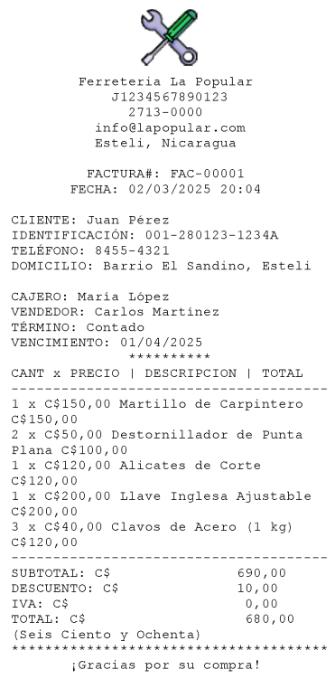

# Thermal Ticket Printer Utility for NetCore

This library is designed to generate and print invoices in a format suitable for thermal printers, specifically those that handle 55mm and 80mm paper widths.

It provides a flexible and customizable way to create invoices with a professional layout, including support for logos, business information, customer details, product lists, and totals.

The library is written in C# and is compatible with Windows Forms applications. It can also be adapted for use in console applications or other .NET environments.



## How To Use It

Create an instance of `ThermalPrinter` to configure the business information

```csharp
var printer = new ThermalPrinter
{
    BusinessName = "Ferretería La Popular",
    Ruc = "J1234567890123",
    Phone = "2713-0000",
    Email = "info@lapopular.com",
    Address = "Esteli, Nicaragua",
    AdditionalText = "¡Gracias por su compra!",
    CurrencySymbol = "C$",
    UseEnglish = false,
    Logo = Image.FromFile(Path.Combine(Environment.GetFolderPath(Environment.SpecialFolder.UserProfile), "Downloads", "logo.png"))
};
```

Then, Create an Invoice

```csharp
var invoice = new Invoice
{
    InvoiceNumber = "FAC-00001",
    Date = DateTime.Now,
    CustomerName = "Juan Pérez",
    CustomerId = "001-280123-1234A",
    CustomerPhone = "8455-4321",
    CustomerAddress = "Barrio El Sandino, Esteli",
    Cashier = "María López",
    Seller = "Carlos Martínez",
    PaymentTerm = "Contado",
    DueDate = DateTime.Now.AddDays(30),
    Subtotal = 690.00m,
    Discount = 10.00m,
    Tax = 0.00m,

    Items = new List<InvoiceItem>
    {
        new InvoiceItem { ProductName = "Martillo de Carpintero", Quantity = 1, Price = 150.00m },
        new InvoiceItem { ProductName = "Destornillador de Punta Plana", Quantity = 2, Price = 50.00m },
        new InvoiceItem { ProductName = "Alicates de Corte", Quantity = 1, Price = 120.00m },
        new InvoiceItem { ProductName = "Llave Inglesa Ajustable", Quantity = 1, Price = 200.00m },
        new InvoiceItem { ProductName = "Clavos de Acero (1 kg)", Quantity = 3, Price = 40.00m }
    }
};

// invoice.Subtotal = invoice.Items.Sum(item => item.Total);
// invoice.Tax = invoice.Subtotal * 0.15m;
```

Print the invoice

```csharp
printer.PrintInvoice(invoice, 80); // 80mm
// printer.PrintInvoice(invoice, 55); // 55mm
```

## Key Features

### Customizable Invoice Layout

- Supports 55mm and 80mm paper widths.
- Allows customization of font size and layout based on paper width.

### Dynamic Content Generation

- Generates invoice content dynamically based on provided data (e.g., business info, customer info, product list).

### Logo Support

- Allows adding a logo to the invoice, which is automatically centered and resized to fit the paper width.

### Tabular Product List

- Displays product details in a tabular format (e.g., Quantity, Price, Description, Total).
- Supports wrapping long descriptions to fit within the paper width.

### Printing Functionality

- Sends the generated invoice content to a printer using the PrintDocument class.
- Supports both physical printers and virtual printers (e.g., PDF printers for testing).

### Error Handling

Includes error handling to catch and report issues during invoice generation or printing.

## TODO

- [ ] Accept different image formats
- [ ] Multi-Language support

## Developer's Information

This library is developed and maintained by [Juan José Zeledón Benavides](https://www.linkedin.com/in/juanjzb/)

If you have any contribution, or you want to report any bug, please feel free to get in touch with me.

- [Github: juanjzb](https://github.com/juanjzb)
- [email: zb.juanjose@gmail.com](mailto:zb.juanjose@gmail.com)
